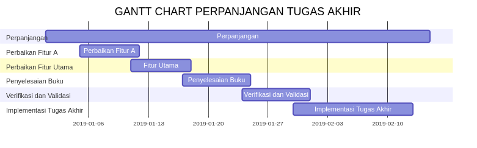

# Perpanjangan TA untuk Informatika UBAYA 101

Untuk mempermudah akses informasi dan proses perpanjangan TA, maka repository GitHub ini didedikasikan untuk membantu seluruh mahasiswa.

# Navigasi

 - [Aturan Perpanjangan](#Aturan_Perpanjangan)
 - [Kesimpulan Aturan Perpanjangan](#Kesimpulan_Aturan_Perpanjangan)
 - [Contoh Gantt Chart dan Cara Membuat Gantt Chart secara Online](#Gantt_Chart)

# Download
 - [Aturan Perpanjangan waktu pengerjaan Tugas Akhir.pdf](./downloadable/Aturan_Perpanjangan_waktu_pengerjaan_Tugas_Akhir.pdf)
 - [Form perpanjangan TA.pdf](./downloadable/Form_perpanjangan_TA.pdf)
 - [Surat Permohonan Sample](./downloadable/Sample_Surat_Perpanjangan_TA.docx)

# Aturan Perpanjangan

**Perpanjangan waktu pengerjaan Tugas Akhir**

 1. Tugas Akhir (TA) dirancang untuk dapat diselesaikan dalam waktu 1 semester.
 2. Sejak semester Genap 2015/2016, pengerjaan TA telah diintegrasikan dengan matakuliah Metodologi Penelitian (MetPen). Untuk bisa <u>lulus MetPen</u>, Mahasiswa peserta MetPen harus sudah mendapatkan topik TA, membuat proposal, dan mengerjakan <u>TA hingga bab 3</u>.
 3. Dengan demikian, saat Mahasiswa mengambil TA di semester setelah MetPen, Mahasiswa tinggal mengerjakan bab 4 – bab 7.
 4. Karena itu, 1 semester yang diberikan untuk mengerjakan TA ini seharusnya sudah sangat cukup
 5. Jika ternyata mahasiswa masih belum juga dapat menyelesaikan TA nya setelah 1 semester maka Jurusan akan mengevaluasi apakah mahasiswa tersebut masih diperbolehkan atau tidak untuk melanjutkan pengerjaan TA tersebut dengan tambahan waktu 1 semester lagi.
 6. Untuk dapat memperoleh tambahan waktu 1 semester lagi, Mahasiswa harus:
	1. . Mengisi form permintaan perpanjangan pengerjaan TA (bisa di download di [repository ini](#Download) atau di [google drive jurusan]([https://drive.google.com/file/d/18MVgKUknkqRsT3t_7A-Xy994lzSJ84Iw/view](https://drive.google.com/file/d/18MVgKUknkqRsT3t_7A-Xy994lzSJ84Iw/view)) atau masuk ke google drive di Folder: Untuk Mahasiswa > Form > TA
	2. Membuat surat permohonan untuk diperbolehkan melanjutkan pengerjaan TA tersebut. Surat ditujukan ke Ketua Jurusan dan harus berisi poin-poin sebagai berikut:
		1. Penjelasan mengapa TA Anda tidak selesai dalam waktu 1 semester
		2. Penjelasan tentang kondisi TA Anda hingga saat ini (apa saja yang sudah
dikerjakan)
		3. Mengapa Anda layak mendapat perpanjangan waktu pengerjaan TA
		4. Target, rencana, dan strategi Anda untuk menyelesaikan TA tersebut dalam
perpanjangan waktu yang diberikan (disertai Gantt Chart yang menunjukkan
aktifitas yang hendak dilakukan, minggu-perminggu)
		5. Tanda tangan Anda dan semua dosen pembimbing
	3. Keseriusan Anda dalam membuat Surat permohonan di nomor 6b akan menentukan
apakah TA Anda dapat diperpanjang atau tidak. Yakinkan kami, bahwa memang Anda layak mendapat perpanjangan. Surat yang tidak meyakin dibuat secara asal-asalan atau diketahui berasal dari copy-paste surat permohonan yang lain, dipastikan tidak akan diberi perpanjangan.

[Sumber Google Drive]([https://drive.google.com/file/d/0B6US5WDOTSSDdllZOFk2YzRWSlk/view](https://drive.google.com/file/d/0B6US5WDOTSSDdllZOFk2YzRWSlk/view))

# Kesimpulan Aturan Perpanjangan
Hal-hal atau berkas-berkas yang dibutuhkan untuk proses perpanjangan TA yakni:
1. Kartu Studi (**KS** atau Screenshot Matakuliah yang diambil saat ini di My UBAYA)
2. Transkrip (download yang terbaru di My UBAYA)
3. Dua BAB Terakhir
4. Gantt Chart Timeline untuk Proses Pengerjaan TA bila Perpanjangan Disetujui ([cek disini](#Gantt_Chart))
5. Form Perpanjangan ([Download](#Download))
6. Surat Permohonan ([Download](#Download))

Kumpulkan di PAJ setelah Surat Permohonan telah ditandatangani oleh kedua Dosen Pembimbing dan Form Permohonan telah ditandatangi oleh kedua Dosen Pembimbing dan Ketua Jurusan (Kajur).

# Gantt Chart
Gantt Chart untuk Timeline Pengerjaan selama masa Perpanjangan

**Sample**

Untuk membuat Gantt Chart dapat menggunakan [Mermaid Live Editor](https://mermaidjs.github.io/mermaid-live-editor/) 
Tulisan perpanjangan sebetulnya tidak diperlukan.

